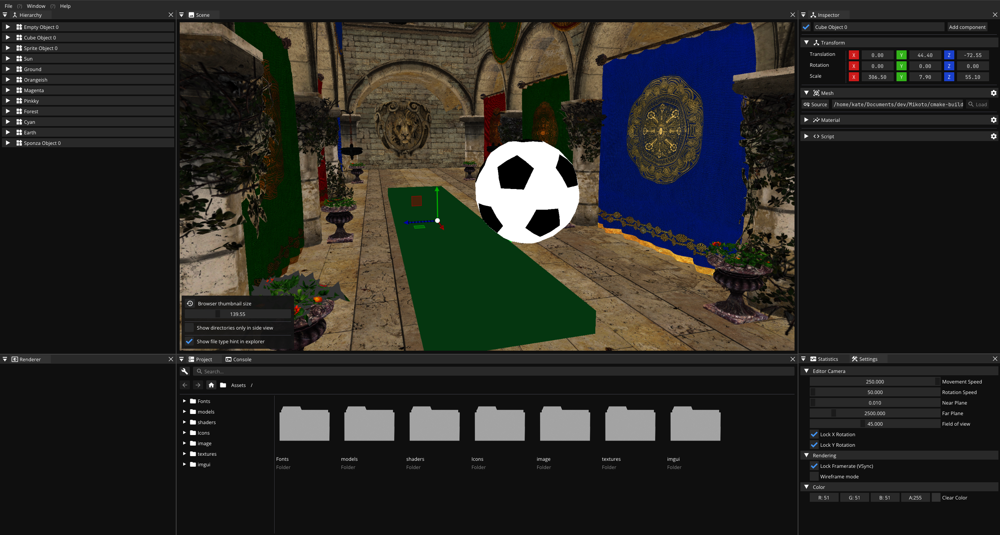
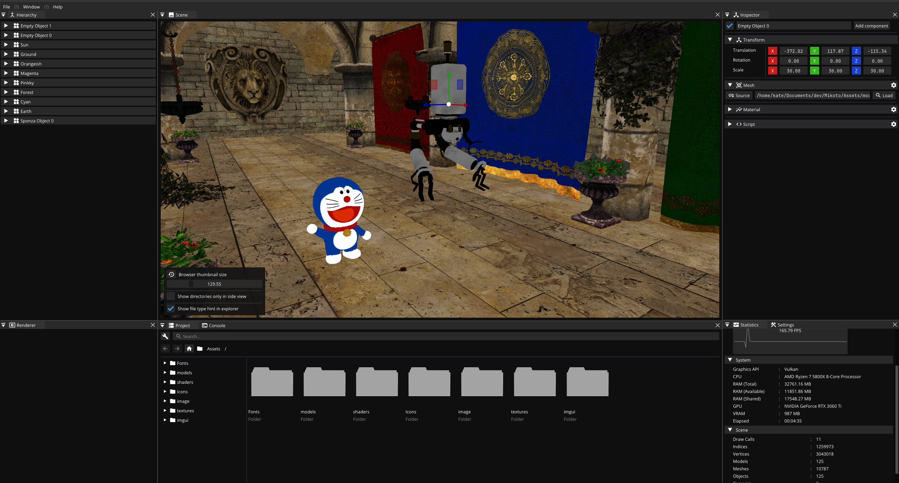
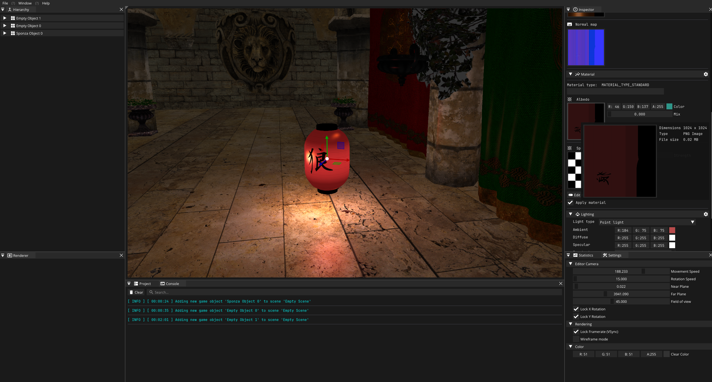

# Mikoto Engine

**Mikoto** is an open-source, Vulkan-based game engine written in modern C++. Developed as an educational project, the engine aims to provide hands-on learning experiences in graphics programming while helping me explore the capabilities of the Vulkan API.

---


---



---



---

### Supported Features

| **Feature Name**          | **Feature Description**                           | **Supported** |
|---------------------------|---------------------------------------------------|---------------|
| Model Loading             | Ability to load 3D models from various file types | ✅             |
| Image Loading             | Support for loading and using textures/images     | ✅             |
| Blinn-Phong Lighting      | Basic lighting model implementation               | ✅             |
| Entity Component System   | Management of scene game objects through ECS      | ✅             |
| Game Object Serialization | Save and load objects to/from disk                | ❌             |
| Particle System           | Visual particle effects like smoke, fire, etc.    | ❌             |
| Vulkan Ray Tracing        | Support for Vulkan RayTracing                     | ❌             |
| Physics Integration       | Basic collision detection and response            | ❌             |
| UI Integration (ImGui)    | Immediate mode GUI for runtime/editor UI          | ✅             |
| Texture loading           | Support for loading texture images                | ✅             |
| Animation System          | Skeletal animation and keyframe interpolation     | ❌             |
| Audio Support             | Load and play sound effects and background music  | ❌             |

## Supported Platforms

| Platform | Status    |
|----------|-----------|
| Linux    | Supported |
| Windows  | Supported |

---

## Requirements

### Software Requirements
- **CMake** 3.18 or higher.
- **The Vulkan SDK**: Available from [Vulkan](https://vulkan.lunarg.com/).
- **C++20 Compiler**: Tested with GCC 12.3.0.
- **GLSL-C**: Optional, as precompiled shader binaries are included.

---

## Folder Structure

- **`Resources/`**: Extra utilities like screenshots, some models to play around with, etc.
- **`Mikoto-Engine/`**: The core engine that powers the Mikoto Game Engine.
- **`Mikoto-Editor/`**: The editor project for creating and managing game scenes.
- **`Mikoto-Runtime/`**: A sample project that demonstrates the engine's features.

---

## Building Mikoto Engine

Follow the steps below to build Mikoto Engine.
Currently, the building process has been tested on Linux and Windows.

### Steps:

1. **Clone the repository**:
   ```shell
   git clone --recursive https://github.com/kateBea/Mikoto.git
   ```

2. **Navigate to the project directory**:
   ```shell
   cd Mikoto
   ```

3. **Create a build directory**:
   ```shell
   mkdir build && cd build
   ```

4. **Run CMake**:
   ```shell
   cmake -S .. -B .
   ```

5. **Build the project**:
   ```shell
   cmake --build . --config Release
   ```

6. **Run the executable**:
   ```shell
   ./Mikoto-Editor/Mikoto-Editor
   ```

For Visual Studio users, CMake will generate `.sln` files by default. Simply open the solution in Visual Studio and build from there. CLion users can open the project directly and build it without extra steps.
Before you run the editor program you need to copy `engine-config.toml` file to the where you have your working directory; yo also need to copy both the Resources folders to the same directory.

---

## Dependencies

The development of Mikoto Engine is made possible thanks to these fantastic third-party libraries:

| Library                       | Description                                  | Link                                                                                                                |
|-------------------------------|----------------------------------------------|---------------------------------------------------------------------------------------------------------------------|
| **FMT**                       | Modern C++ formatting library                | [fmtlib/fmt](https://github.com/fmtlib/fmt)                                                                         |
| **GLEW**                      | OpenGL Extension Wrangler Library            | [GLEW](https://glew.sourceforge.net/)                                                                               |
| **GLFW**                      | Multi-platform library for window management | [glfw/glfw](https://github.com/glfw/glfw)                                                                           |
| **GLM**                       | OpenGL Mathematics library                   | [g-truc/glm](https://github.com/g-truc/glm)                                                                         |
| **ImGui**                     | Immediate Mode GUI library                   | [ocornut/imgui](https://github.com/ocornut/imgui)                                                                   |
| **Spdlog**                    | Fast C++ logging library                     | [gabime/spdlog](https://github.com/gabime/spdlog)                                                                   |
| **EnTT**                      | Fast and efficient Entity-Component System   | [skypjack/entt](https://github.com/skypjack/entt)                                                                   |
| **Volk**                      | Meta-loader for Vulkan API                   | [zeux/volk](https://github.com/zeux/volk)                                                                           |
| **Assimp**                    | Asset importer library                       | [assimp/assimp](https://github.com/assimp/assimp)                                                                   |
| **VulkanMemoryAllocator**     | Memory allocation for Vulkan resources       | [GPUOpen-LibrariesAndSDKs/VulkanMemoryAllocator](https://github.com/GPUOpen-LibrariesAndSDKs/VulkanMemoryAllocator) |
| **ImGuizmo**                  | Gizmo manipulator for ImGui                  | [CedricGuillemet/ImGuizmo](https://github.com/CedricGuillemet/ImGuizmo)                                             |
| **yaml-cpp**                  | YAML parser and emitter for C++              | [jbeder/yaml-cpp](https://github.com/jbeder/yaml-cpp)                                                               |
| **nativefiledialog-extended** | File dialog library for native UIs           | [btzy/nativefiledialog-extended](https://github.com/btzy/nativefiledialog-extended)                                 |
| **JoltPhysics**               | Physics engine library                       | [jrouwe/JoltPhysics](https://github.com/jrouwe/JoltPhysics)                                                         |
| **tomlplusplus**              | TOML configuration file parser for C++       | [marzer/tomlplusplus](https://github.com/marzer/tomlplusplus)                                                       |
> **Note**: The required libraries are included as a submodules in the project and do not require separate installation, just need to clone the repository with ``--recursive`` flag.

## Goals

The primary goal of Mikoto Engine is to serve as a learning platform for exploring modern graphics programming techniques. Features are implemented progressively as new concepts and ideas are explored.

---

## Special Thanks

The development of Mikoto has been inspired by the work of the following:

- **Joey De Vries** for the incredible [LearnOpenGL](https://learnopengl.com/) tutorials.
- **Yan Chernikov** for his insightful [YouTube videos](https://www.youtube.com/@TheCherno).
- **Cem Yuksel** for his educational [graphics programming videos](https://www.youtube.com/@cem_yuksel/videos).
- **Jason Gregory** for the book *[Game Engine Architecture](https://www.gameenginebook.com/)*.
- **Matt Pharr, Wenzel Jakob, Greg Humphreys** for *[Physically Based Rendering: From Theory to Implementation](https://www.pbr-book.org/)*.
- **Sascha Willems** for the [Vulkan examples repository](https://github.com/SaschaWillems/Vulkan).

---

## Future Development

Mikoto Engine is still in its early stages, and additional features and optimizations will be added over time.
Feedback is always welcome!

---

## License

This project is licensed under the **Apache License 2.0**.

You are free to use, modify, and distribute this software under the terms of the Apache License 2.0. A copy of the license is included in the repository.

For the full license text, see the [LICENSE](LICENSE) file in the repository.

