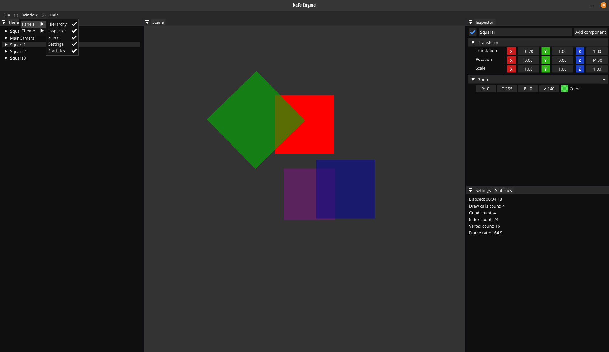

# Mikoto Engine
This is a simple engine written in modern C++. For now and quite some time 
it will use OpenGL as its main rendering API, but the end goal is to integrate Vulkan.



# Building

Clone the repository, at the moment I only tested building on Linux. 
The project already comes with a CMake file ready to use. 


This project is done thanks to various third-party libraries:

1. [FMT (Modern formatting library)](https://github.com/fmtlib/fmt)
2. [GLEW (Open GL extension Wrangler)](https://glew.sourceforge.net/)
3. [GLFW (Multiplatform Library for Window, Event handling, etc.)](https://github.com/glfw/glfw)
4. [GLM (Open GL Mathematics Library for C++)](https://github.com/g-truc/glm)
5. [ImGui (Graphical User interface Library for C++)](https://github.com/ocornut/imgui)
6. [Spdlog (Fast C++ Logging Library)](https://github.com/gabime/spdlog)

The following tools are required on Linux:

1. G++ (GNU C++ Compiler)
2. CMake (Cross platform build system)

The GLFW library is not necessary to be installed on the system since it 
is included as a submodule and build along with the project.

- Clone the repository
    ```shell
    git clone --recursive https://github.com/kateBea/kaTe-Engine.git && cd kaTe-Engine
    ```
- Create a build directory
    ```shell
    mkdir build && cd build
    ```

- Run CMake
    ```shell
    cmake ..
    ```
  
- Build the project using CMake
    ```shell
    cmake --build .
    ```

# Goals

The main goal is really just offer support for 3D and 2D graphics rendering. A the moment many configurations necessary for
the engine are hardcoded in the translation units, the idea is to be able to load these configurations from ragular files.

# Special thanks and mentions to
  - Yan Chernikov for his [YouTube videos](https://www.youtube.com/@TheCherno) and live streams
  - Cem Yuksel for his [YouTube videos](https://www.youtube.com/@cem_yuksel/videos) about graphics programing
  - Jason Gregory for the [Game Engine Architecture](https://www.gameenginebook.com/) book
  - Matt Pharr, Wenzel Jakob, Greg Humphreys for the [Physically Based Rendering: From Theory to Implementation](https://www.pbr-book.org/)
