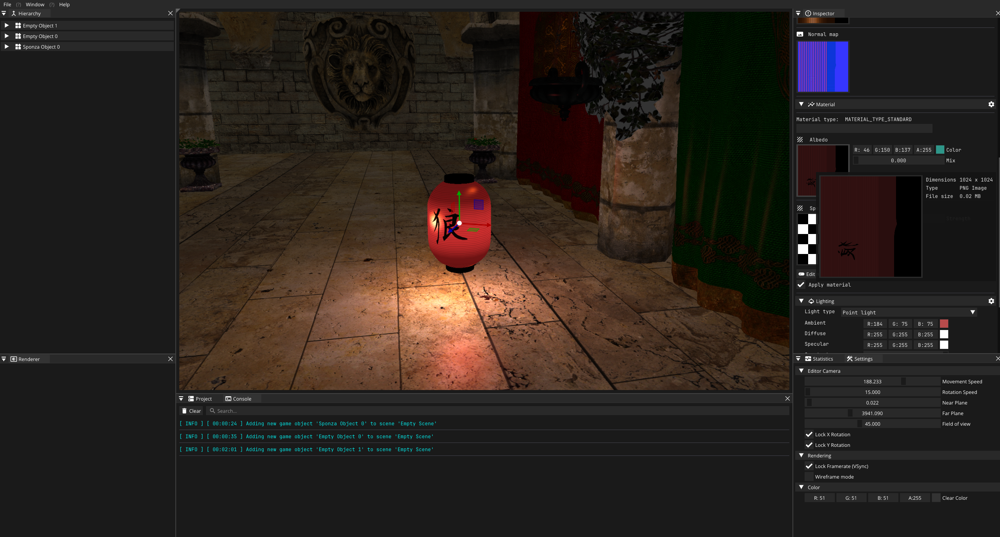

# Mikoto Engine
This is a simple engine written in modern C++. For now and quite some time 
it will use OpenGL as its main rendering API, but the end goal is to integrate Vulkan.



# Implemented features

# Supported platforms

# Requirements
<h3>Software Requirements:</h3>
<ol type="1">
  <li>CMake 3.21 (This is what the project uses, but an earlier version is most likely to work)</li>
  <li>A compiler capable of C++20 (G++ 12.3.0 was used for the tests)</li>
  <li>The Vulkan SDK</li>
  <li>OpenGL library</li>
  <li>GLSL-C (The glsl compiler). This one is optional as there's precompiled binaries.</li>
</ol>

# Folder structure
- <b>Assets:</b> Contains core engine/editor utilities, prefabs, and essential assets such as shaders.
- <b>Common:</b> Common development utilities, definitions of structures, data types, etc.
- <b>Mikoto-Engine:</b> The core engine project which powers Mikoto Game Engine.
- <b>Mikoto-Editor:</b> The editor project featuring the game scenes' editor.
- <b>Mikoto-Runtime:</b> A sample game showcasing the capabilities of Mikoto Game Engine.

# Building

Clone the repository. The project already comes with a CMake file ready to use. At the moment I only tested building on 
Linux, the process should be similar on Windows. If you have Visual Studio installed, CMake will generate VS project 
files by default, open the solution file and build the project from there. In case you have CLion, you could also just 
the CMake as a project and build just fine. The following steps just show how to build from a terminal.

```shell
  # Clone the repository to your desired directory
  git clone --recursive https://github.com/kateBea/Mikoto-Engine.git
  
  # Change directory to the repo folder
  cd Mikoto-Engine
  
  # Make a build directory (preferable)
  mkdir build 
  
  # and open the build directory
  cd build
  
  # Run CMake on the CMake file from the repo root directory
  cmake -S .. -B .
  
  # Finally build the project
  cmake --build . --config Release
  
  # and run the executable (if on Linux, the executable should be in build folder)
  ./Mikoto
```

# Dependencies
This project is done thanks to various third-party libraries:

1. [FMT (Modern formatting library)](https://github.com/fmtlib/fmt)
2. [GLEW (Open GL extension Wrangler)](https://glew.sourceforge.net/)
3. [GLFW (Multiplatform Library for Window, Event handling, etc.)](https://github.com/glfw/glfw)
4. [GLM (Open GL Mathematics Library for C++)](https://github.com/g-truc/glm)
5. [ImGui (Graphical User interface Library for C++)](https://github.com/ocornut/imgui)
6. [Spdlog (Fast C++ Logging Library)](https://github.com/gabime/spdlog)

The GLFW library is not necessary to be installed on the system since it 
is included as a submodule and build along with the project.

# Goals

This project serves as a way for me to learn 3D graphics programming with modern rendering techniques, as such I intend 
to integrate the things I learn along the way.

# Special thanks and mentions to
  - Yan Chernikov for his [YouTube videos](https://www.youtube.com/@TheCherno) and live streams
  - Cem Yuksel for his [YouTube videos](https://www.youtube.com/@cem_yuksel/videos) about graphics programing
  - Jason Gregory for the [Game Engine Architecture](https://www.gameenginebook.com/) book
  - Matt Pharr, Wenzel Jakob, Greg Humphreys for the [Physically Based Rendering: From Theory to Implementation](https://www.pbr-book.org/)
  - Sascha Willems for the [Vulkan examples](https://github.com/SaschaWillems/Vulkan)
