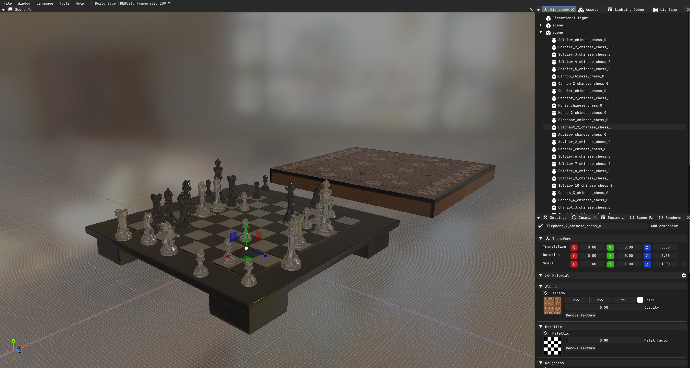
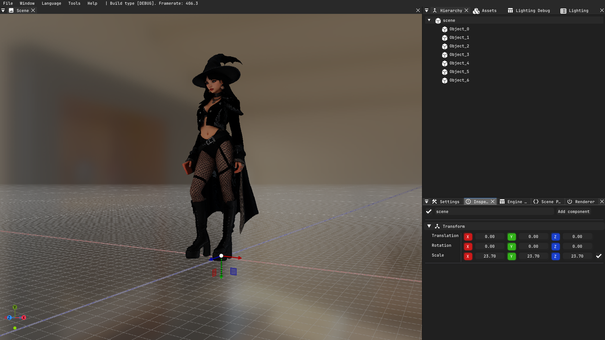
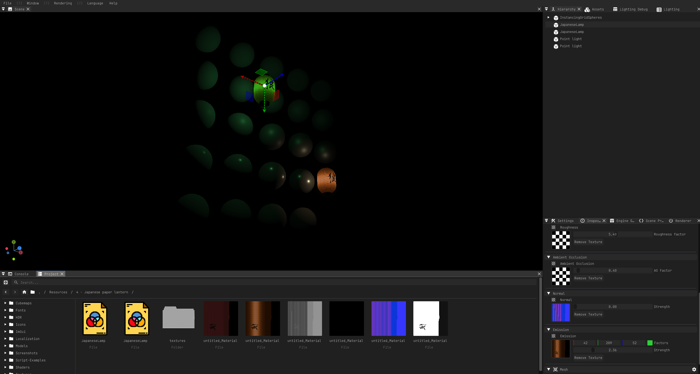
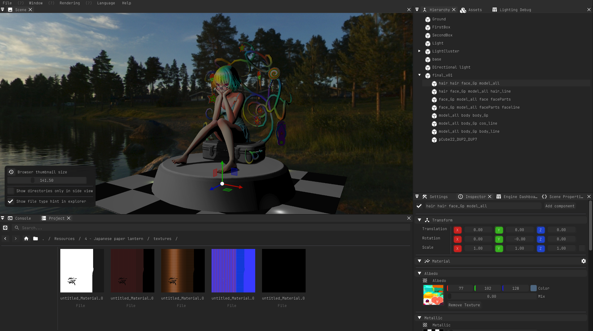
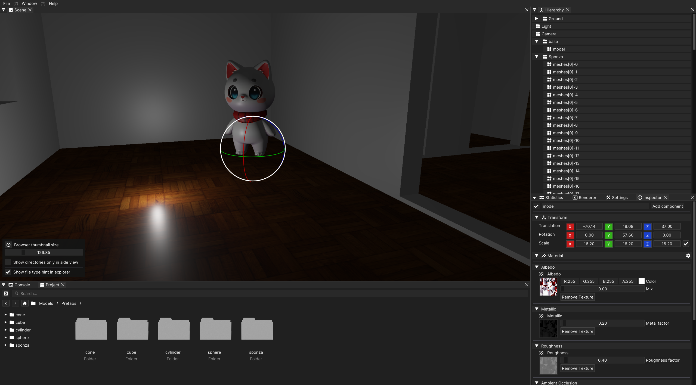
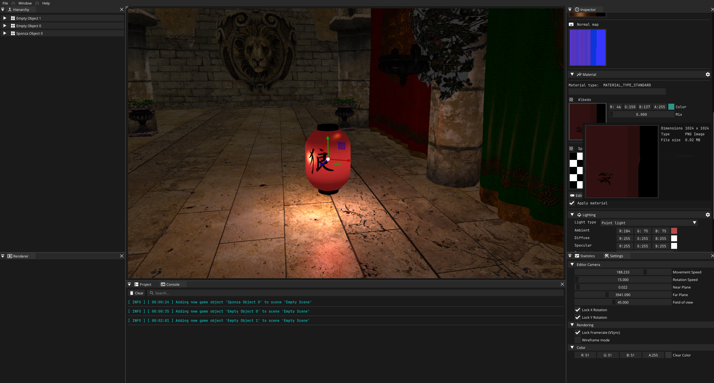

# Mikoto Engine

[](https://www.codefactor.io/repository/github/katebea/mikoto)
[](https://opensource.org/licenses/Apache-2.0)

**Mikoto** is an open-source, Vulkan-based game engine written in modern C++. Developed as an educational project, the engine aims to provide hands-on learning experiences in graphics programming while helping me explore the capabilities of the Vulkan API.

The ``develop`` branch is a WIP for the Mikoto's new architecture. It brings some new features, like resources pools, automatic resource cleanup, and abstraction on top of render
passes, amongst other features.

---



---



---



---



---



---



---

### Feature List

| **Category**       | **Feature Name**               | **Feature Description**                                   | **Supported**              |
|--------------------|--------------------------------|-----------------------------------------------------------|----------------------------|
| **Core Engine**    | Model Loading                  | Load 3D models via Assimp                                 | ✔️                         |
|                    | Image Loading                  | Texture/Image loading via STB_Image                       | ✔️                         |
|                    | Cube maps                      | Load equirectangular HDR images and use them as cube maps | ✔️                         |
|                    | Entity Component System        | ECS for scene/game object management                      | ✔️                         |
|                    | Scene Serialization            | Editor scene save/load                                    | ❌ (WIP)                    |
|                    | Particle System                | GPU particle simulation (fire, smoke, sparks, etc.)       | ❌                          |
|                    | Vulkan Ray Tracing             | Hardware accelerated RT                                   | ❌                          |
|                    | Physics Integration            | Basic collision detection with Jolt                       | ✔️                         |
|                    | UI Integration (ImGui)         | Runtime + editor ImGui                                    | ✔️                         |
|                    | Animation System               | Skeletal animation, skinning                              | ❌                          |
|                    | Audio Support                  | Load and play audio                                       | ✔️                         |
|                    | Text Rendering / Overlay       | MSDF-based text rendering                                 | ❌                          |
| **Visual Effects** | Clustered Forward+             | Main render path with clustered/forward+ lighting         | ✔️                         |
|                    | Clustered Light Culling        | Per-tile/cluster light assignment                         | ✔️                         |
|                    | Mesh Culling                   | CPU mesh visibility culling                               | ❌                          |
|                    | IBL (Image-Based Lighting)     | Diffuse irradiance + specular reflections                 | ❌                          |
|                    | Shadows                        | Directional, point, spot shadows                          | ❌                          |
|                    | Cascaded Shadow Maps (CSM)     | Multi-split directional shadows                           | ❌                          |
|                    | Outline Pass                   | Object outlining effect                                   | ❌                          |
|                    | Infinite Grid                  | Procedural grid for editor/world                          | ✔️                          |
|                    | Bloom                          | Multi-pass bright blur                                    | ❌                          |
|                    | Depth of Field (DoF)           | DoF effect                                                | ❌                          |
|                    | Screen-Space Reflections (SSR) | Reflections in screen space                               | ❌                          |
|                    | Screen-Space GI (SSGI)         | Screen-space diffuse bounce lighting                      | ❌                          |
| **Editor / Tools** | Gizmos (ImGuizmo)              | Move/rotate/scale gizmos                                  | ✔️ (Positions only)        |
|                    | Profiling / GPU Timers         | Pass timing, pipeline stats                               | ❌ (WIP)                    |
|                    | Asset Streaming                | Task-based async resource loading                         | ❌                          |
|                    | Shader hot reloading           | Shader hot reload                                         | ❌                          |
|                    | Asset hot reloading            | Asset hot reload for scripts, etc.                        | ✔️ (Limited, Scripts only) |

### **Platform Support**

| Platform / Toolchain              | Architecture | Status                 | Notes      |
|-----------------------------------|--------------|------------------------|------------|
| **Ubuntu 24.04 LTS** (GCC 13.3.0) | x86_64       | **Supported (Tested)** | Tested     |
| Other Linux Distros               | x86_64       | **Untested**           | Untested   |
| **Windows (MSVC)**                | x86_64       | **Supported (Tested)** | Tested     |
| Windows (MinGW-w64)               | x86_64       | **Untested**           | Not tested |

> Note: This project has been tested on Ubuntu 24.04 for Linux compatibility. While it 
> works properly on Windows, other Linux distributions are currently untested.

---

## Requirements

### Software Requirements
### **Software Requirements**

- **CMake 3.22+** – Required for configuring and building the project.
- **Vulkan SDK** – Install from the official [LunarG SDK](https://vulkan.lunarg.com/).
- **C++20-compatible compiler** – Tested with **GCC 13.3.0**; other C++20 compilers should work but are untested.
- **Visual Studio 2022 onwards (Windows)** – Recommended IDE and toolchain for Windows builds.
- **GLSL-C (Optional)** – Only needed if you want to recompile shaders; precompiled SPIR-V binaries are already included.

---

## Folder Structure

- **`Resources/`**: Resources screenshots and some models to play around with.
- **`Mikoto-Engine/`**: The core engine that powers the editor.
- **`Mikoto-Editor/`**: The editor project for creating and managing game scenes.
- **`Mikoto-Sandbox/`**: A sample project that demonstrates some of the engine's features.
- **`Mikoto-Tests/`**: Contains lists of tests against the core engine.
- **`Mikoto-Apps/`**: Standalone applications that showcase Mikoto features

>Some models used for demos were downloaded from Morgan McGuire's Computer Graphics Archive https://casual-effects.com/data

---

## Building Mikoto Engine

The build process is currently verified on both Linux and Windows.
On Windows, the only requirements are the Vulkan SDK and Visual Studio.

## Pre-Setup

Mikoto uses **Lua 5.1+** for scripting. To set it up on Linux, follow these steps:

1. Download Lua from the official Lua downloads page: [https://www.lua.org/download.html](https://www.lua.org/download.html) and get the `.tar.gz` file.

2. Run the following commands in your terminal:
```bash
# Access contents
tar -xvf lua-5.4.8.tar.gz
cd lua-5.4.8

# Install and tests lua
sudo make
sudo make test
sudo make install
```
If lua has been installed, the command ``lua -v`` should print something like the following:

```
Lua 5.4.8  Copyright (C) 1994-2025 Lua.org, PUC-Rio
```

>Precompiled binaries are shipped with Mikoto to compile with MSVC on Windows.

## Project Build

On Linux, we need to install certain dependencies to get started, we can do so by passing target InstallDependencies
(``--target InstallDependencies``) to CMake command to install necessary dependencies, user might be
prompted to give permissions:

```
cmake --build . --target InstallDependencies --config Release 
cmake --build . --config Release
```

### Linux Required libraries

Following there's an example installation directly from the terminal on Ubuntu 24.04 (commands extracted from [install.sh](/Mikoto/Resources/installs.sh)):

```shell
# Vulkan
sudo apt install vulkan-tools
sudo apt install libvulkan-dev  vulkan-validationlayers
sudo apt install vulkan-utility-libraries-dev spirv-tools

# Native file dialog
sudo apt-get install libgtk-3-dev

# GLFW
sudo apt install libwayland-dev libxkbcommon-dev xorg-dev
   
   ```
---

With the dependencies installed we can proceed with building the project:

```shell
# Fetch the repository. Recurse to pull the submodules
git clone --recursive https://github.com/kateBea/Mikoto.git
cd Mikoto

# Generate platform specific build system files
mkdir build && cd build

# This will pull the necessary third party repos
cmake -S .. -B .

# Build the application
cmake --build . --config Release
```
---
For Visual Studio users, CMake will generate `.sln` files by default. We want to open the solution in Visual Studio 
and build from  there. CLion users can open the project directly and build it without extra steps.

## Dependencies

The development of Mikoto Engine is made possible thanks to these fantastic third-party libraries:

| Library                       | Description                                   | Link                                                                                                                |
|-------------------------------|-----------------------------------------------|---------------------------------------------------------------------------------------------------------------------|
| **FMT**                       | Modern C++ formatting library                 | [fmtlib/fmt](https://github.com/fmtlib/fmt)                                                                         |
| **GLEW**                      | OpenGL Extension Wrangler Library             | [GLEW](https://glew.sourceforge.net/)                                                                               |
| **GLFW**                      | Multi-platform library for window management  | [glfw/glfw](https://github.com/glfw/glfw)                                                                           |
| **GLM**                       | OpenGL Mathematics library                    | [g-truc/glm](https://github.com/g-truc/glm)                                                                         |
| **ImGui**                     | Immediate Mode GUI library                    | [ocornut/imgui](https://github.com/ocornut/imgui)                                                                   |
| **Spdlog**                    | Fast C++ logging library                      | [gabime/spdlog](https://github.com/gabime/spdlog)                                                                   |
| **EnTT**                      | Fast and efficient Entity-Component System    | [skypjack/entt](https://github.com/skypjack/entt)                                                                   |
| **Volk**                      | Meta-loader for Vulkan API                    | [zeux/volk](https://github.com/zeux/volk)                                                                           |
| **Assimp**                    | Asset importer library                        | [assimp/assimp](https://github.com/assimp/assimp)                                                                   |
| **VulkanMemoryAllocator**     | Memory allocation for Vulkan resources        | [GPUOpen-LibrariesAndSDKs/VulkanMemoryAllocator](https://github.com/GPUOpen-LibrariesAndSDKs/VulkanMemoryAllocator) |
| **ImGuizmo**                  | Gizmo manipulator for ImGui                   | [CedricGuillemet/ImGuizmo](https://github.com/CedricGuillemet/ImGuizmo)                                             |
| **yaml-cpp**                  | YAML parser and emitter for C++               | [jbeder/yaml-cpp](https://github.com/jbeder/yaml-cpp)                                                               |
| **nativefiledialog-extended** | File dialog library for native UIs            | [btzy/nativefiledialog-extended](https://github.com/btzy/nativefiledialog-extended)                                 |
| **JoltPhysics**               | Physics engine library                        | [jrouwe/JoltPhysics](https://github.com/jrouwe/JoltPhysics)                                                         |
| **tomlplusplus**              | TOML configuration file parser for C++        | [marzer/tomlplusplus](https://github.com/marzer/tomlplusplus)                                                       |
| **stb_image**                 | Image loading library                         | [nothings/stb](https://github.com/nothings/stb.git)                                                                 |
| **msdf-atlas-gen**            | Multi-channel signed distance field generator | [Chlumsky/msdf-atlas-gen](https://github.com/Chlumsky/msdf-atlas-gen.git)                                           |
| **TaskFlow**                  | Moder C++ Task library                        | [https://github.com/taskflow/taskflow)                                                                              |
| **Sol2**                      | Moder C++ Library for Scripting with Lua      | [https://github.com/ThePhD/sol2)                                                                                    |

## Networking
Mikoto includes a networking layer built on top of ASIO to support TCP sockets.
The engine supports both HTTP and HTTPS connections, but HTTPS requires OpenSSL to be installed on your system.
If OpenSSL is not available the engine falls back to HTTP support only.

## Profiling with Tracy

Mikoto integrates the Tracy Profiler for CPU, GPU, and memory profiling.
>When Tracy instrumentation is enabled, the Tracy Profiler GUI must be running.
If the profiler is not connected, Tracy will continue to run internally, which can lead to memory leaks.
> By default Tracy is disabled, in order to enabled one must compile with the ``MIKOTO_ENABLE_TRACY_PROFILING``
> flag enabled in the ``CmakeLists.txt`` file. See the [Editor CMake](Mikoto-Editor/CMakeLists.txt) file for reference.
> 
> User will need to run Mikoto with latest Tracy's Profiler build or, more specifically the Profiler from the version used to build
> the engine.

## Slang in Mikoto

Mikoto uses the **Slang shading language** for runtima shader compilation and reflection.  
The engine ships with **precompiled Slang binaries**, so no manual setup is required to use Slang with Mikoto.

If you prefer to download or update Slang manually, you can find the official releases here:

- **Slang GitHub Repository:** https://github.com/shader-slang/slang  
- **Latest Slang Release Used by Mikoto (v2026.3.1):** https://github.com/shader-slang/slang/releases/tag/v2026.3.1

Mikoto will automatically use the bundled version, but replacing it with another official release is supported as long as the Slang directory structure remains unchanged.

## Goals

The primary goal of Mikoto Engine is to serve as a learning platform for exploring modern graphics programming techniques. Features are implemented progressively as new concepts and ideas are explored.

---

## Special Thanks

The development of Mikoto has been inspired by the work of the following:

- **Joey De Vries** for the incredible [LearnOpenGL](https://learnopengl.com/) tutorials.
- **Yan Chernikov** for his insightful [YouTube videos](https://www.youtube.com/@TheCherno).
- **Cem Yuksel** for his educational [graphics programming videos](https://www.youtube.com/@cem_yuksel/videos).
- **Jason Gregory** for the book *[Game Engine Architecture](https://www.gameenginebook.com/)*.
- **Matt Pharr, Wenzel Jakob, Greg Humphreys** for *[Physically Based Rendering: From Theory to Implementation](https://www.pbr-book.org/)*.
- **Sascha Willems** for the [Vulkan examples repository](https://github.com/SaschaWillems/Vulkan).
- **Marco Castorina and Gabriel Sassone** for the Mastering Graphics Programming with Vulkan Book.

---

## Future Development

Mikoto Engine is still in its early stages, and additional features and optimizations will be added over time.
Feedback is always welcome!

---

## License

This project is licensed under the **Apache License 2.0**.

You are free to use, modify, and distribute this software under the terms of the Apache License 2.0. A copy of the license is included in the repository.

For the full license text, see the [LICENSE](LICENSE) file in the repository.

