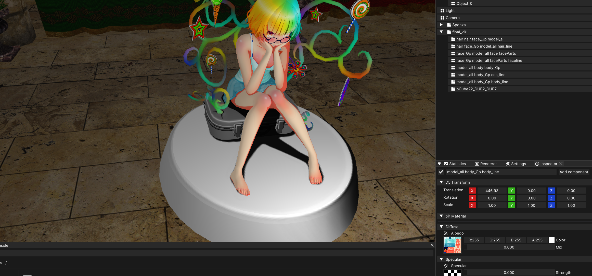

# Mikoto Engine

**Mikoto** is an open-source, Vulkan-based game engine written in modern C++. Developed as an educational project, the engine aims to provide hands-on learning experiences in graphics programming while helping me explore the capabilities of the Vulkan API.

The ``new-arch`` branch is a WIP for the Mikoto's new architecture. It brings some new features, like resources pools, automatic resource cleanup, and abstraction on top of render
passes, amongst other features.

---


---



---

### Supported Features

| **Feature Name**        | **Feature Description**                                  | **Supported** |
|-------------------------|----------------------------------------------------------|---------------|
| Model Loading           | Ability to load 3D models from various file types        | ✔️            |
| Image Loading           | Support for loading and using textures/images            | ✔️            |
| Blinn-Phong Lighting    | Basic lighting model implementation                      | ❌             |
| Entity Component System | Management of scene game objects through ECS             | ❌             |
| Scene Serialization     | Serialize scenes from the editor                         | ❌             |
| Particle System         | Visual particle effects like smoke, fire, etc.           | ❌             |
| Vulkan Ray Tracing      | Support for Vulkan RayTracing                            | ❌             |
| Physics Integration     | Basic collision detection and response                   | ❌             |
| UI Integration (ImGui)  | Immediate mode GUI for the runtime                       | ✔️            |
| Animation System        | Skeletal animation and keyframe interpolation            | ❌             |
| Audio Support           | Load and play sound effects and background music         | ✔️            |
| Text Rendering          | Ability to render text in the 3D world and as an overlay | ❌             |

## Supported Platforms

| Platform | Status    |
|----------|-----------|
| Linux    | Supported |
| Windows  | Supported |

---

## Requirements

### Software Requirements
- **CMake** 3.22 or higher.
- **The Vulkan SDK**: Available from [Vulkan](https://vulkan.lunarg.com/).
- **C++20 Compiler**: Tested with GCC 13.3.0
- **GLSL-C**: Optional, as precompiled shader binaries are included.

---

## Folder Structure

- **`Resources/`**: Resources screenshots and some models to play around with.
- **`Mikoto-Engine/`**: The core engine that powers the editor.
- **`Mikoto-Editor/`**: The editor project for creating and managing game scenes.
- **`Mikoto-Sandbox/`**: A sample project that demonstrates some of the engine's features.

---

## Building Mikoto Engine

Follow the steps below to build Mikoto Engine.
Currently, the building process has been tested on Linux and Windows.

### Steps:

```shell
# Fetch the repository. Recurse to pull the submodules
git clone --recursive https://github.com/kateBea/Mikoto.git
cd Mikoto

# Generate platform specific build system files
mkdir build && cd build

# This will pull the necessary third party repos
cmake -S .. -B .

# Build the application
cmake --build . --config Release
   
   ```
---

For Visual Studio users, CMake will generate `.sln` files by default. Open the solution in Visual Studio and build from there. CLion users can open the project directly and build it without extra steps.
The following are commands needed to install the necessary libraries on Linux, also available in the file [install.sh](/Mikoto/Resources/installs.sh)
Optionally pass target InstallDependencies (``--target InstallDependencies``) to installa necessary dependencies by running the script, user will be prompted to give permissions:

```
cmake --build . --target InstallDependencies --config Release 
cmake --build . --config Release
```

## Linux Required libraries

```shell
# Vulkan
sudo apt install vulkan-tools
sudo apt install libvulkan-dev
sudo apt install vulkan-utility-libraries-dev spirv-tools

# Native file dialog
sudo apt-get install libgtk-3-dev

# GLFW
sudo apt install libwayland-dev libxkbcommon-dev xorg-dev
   
   ```
---

## Lua Scripting Pre-Setup

Mikoto uses **Lua 5.4+** for scripting. To set it up on Linux, follow these steps:

1. Download Lua from the official Lua downloads page: [https://www.lua.org/download.html](https://www.lua.org/download.html) and get the `.tar.gz` file.

2. Run the following commands in your terminal:
```bash
# Access contents
tar -xvf lua-5.4.8.tar.gz
cd lua-5.4.8

# Install and tests lua
sudo make
sudo make test
sudo make install
```

If you are on Windows and have MinGW installed, you can use the following commands to build and install Lua:

```bash
# Access contents
tar -xvf lua-5.4.8.tar.gz
cd lua-5.4.8/src

# Install and tests lua
sudo make
sudo make mingw
```

After this you would need to set the variables in your environment to point to the Lua installation path.
- ``LUA_DIR``: Path to the Lua installation directory.
- ``LUA_INCLUDE_DIR``: Path to the Lua include directory (usually ``<LUA_DIR>/include``).
- ``LUA_LIBRARY``: Path to the Lua library file (usually ``<LUA_DIR>/lib/lua.a`` or ``<LUA_DIR>/lib/lua.lib`` or so).

If lua has been installed, the command ``lua -v`` should print something like the following:

```
Lua 5.4.8  Copyright (C) 1994-2025 Lua.org, PUC-Rio
```
## Dependencies

The development of Mikoto Engine is made possible thanks to these fantastic third-party libraries:

| Library                       | Description                                   | Link                                                                                                                |
|-------------------------------|-----------------------------------------------|---------------------------------------------------------------------------------------------------------------------|
| **FMT**                       | Modern C++ formatting library                 | [fmtlib/fmt](https://github.com/fmtlib/fmt)                                                                         |
| **GLEW**                      | OpenGL Extension Wrangler Library             | [GLEW](https://glew.sourceforge.net/)                                                                               |
| **GLFW**                      | Multi-platform library for window management  | [glfw/glfw](https://github.com/glfw/glfw)                                                                           |
| **GLM**                       | OpenGL Mathematics library                    | [g-truc/glm](https://github.com/g-truc/glm)                                                                         |
| **ImGui**                     | Immediate Mode GUI library                    | [ocornut/imgui](https://github.com/ocornut/imgui)                                                                   |
| **Spdlog**                    | Fast C++ logging library                      | [gabime/spdlog](https://github.com/gabime/spdlog)                                                                   |
| **EnTT**                      | Fast and efficient Entity-Component System    | [skypjack/entt](https://github.com/skypjack/entt)                                                                   |
| **Volk**                      | Meta-loader for Vulkan API                    | [zeux/volk](https://github.com/zeux/volk)                                                                           |
| **Assimp**                    | Asset importer library                        | [assimp/assimp](https://github.com/assimp/assimp)                                                                   |
| **VulkanMemoryAllocator**     | Memory allocation for Vulkan resources        | [GPUOpen-LibrariesAndSDKs/VulkanMemoryAllocator](https://github.com/GPUOpen-LibrariesAndSDKs/VulkanMemoryAllocator) |
| **ImGuizmo**                  | Gizmo manipulator for ImGui                   | [CedricGuillemet/ImGuizmo](https://github.com/CedricGuillemet/ImGuizmo)                                             |
| **yaml-cpp**                  | YAML parser and emitter for C++               | [jbeder/yaml-cpp](https://github.com/jbeder/yaml-cpp)                                                               |
| **nativefiledialog-extended** | File dialog library for native UIs            | [btzy/nativefiledialog-extended](https://github.com/btzy/nativefiledialog-extended)                                 |
| **JoltPhysics**               | Physics engine library                        | [jrouwe/JoltPhysics](https://github.com/jrouwe/JoltPhysics)                                                         |
| **tomlplusplus**              | TOML configuration file parser for C++        | [marzer/tomlplusplus](https://github.com/marzer/tomlplusplus)                                                       |
| **stb_image**                 | Image loading library                         | [nothings/stb](https://github.com/nothings/stb.git)                                                                 |
| **msdf-atlas-gen**            | Multi-channel signed distance field generator | [Chlumsky/msdf-atlas-gen](https://github.com/Chlumsky/msdf-atlas-gen.git)                                           |
| **TaskFlow**                  | Moder C++ Task library                        | [https://github.com/taskflow/taskflow)                                                                              |
| **Sol2**                      | Moder C++ Library for Scripting with Lua      | [https://github.com/ThePhD/sol2)                                                                                    |

> **Note**: The required libraries are included as a submodules in the project and do not require separate installation, just need to clone the repository with ``--recursive`` flag.

## Goals

The primary goal of Mikoto Engine is to serve as a learning platform for exploring modern graphics programming techniques. Features are implemented progressively as new concepts and ideas are explored.

---

## Special Thanks

The development of Mikoto has been inspired by the work of the following:

- **Joey De Vries** for the incredible [LearnOpenGL](https://learnopengl.com/) tutorials.
- **Yan Chernikov** for his insightful [YouTube videos](https://www.youtube.com/@TheCherno).
- **Cem Yuksel** for his educational [graphics programming videos](https://www.youtube.com/@cem_yuksel/videos).
- **Jason Gregory** for the book *[Game Engine Architecture](https://www.gameenginebook.com/)*.
- **Matt Pharr, Wenzel Jakob, Greg Humphreys** for *[Physically Based Rendering: From Theory to Implementation](https://www.pbr-book.org/)*.
- **Sascha Willems** for the [Vulkan examples repository](https://github.com/SaschaWillems/Vulkan).
- **Marco Castorina and Gabriel Sassone** for the Mastering Graphics Programming with Vulkan Book.

---

## Future Development

Mikoto Engine is still in its early stages, and additional features and optimizations will be added over time.
Feedback is always welcome!

---

## License

This project is licensed under the **Apache License 2.0**.

You are free to use, modify, and distribute this software under the terms of the Apache License 2.0. A copy of the license is included in the repository.

For the full license text, see the [LICENSE](LICENSE) file in the repository.

