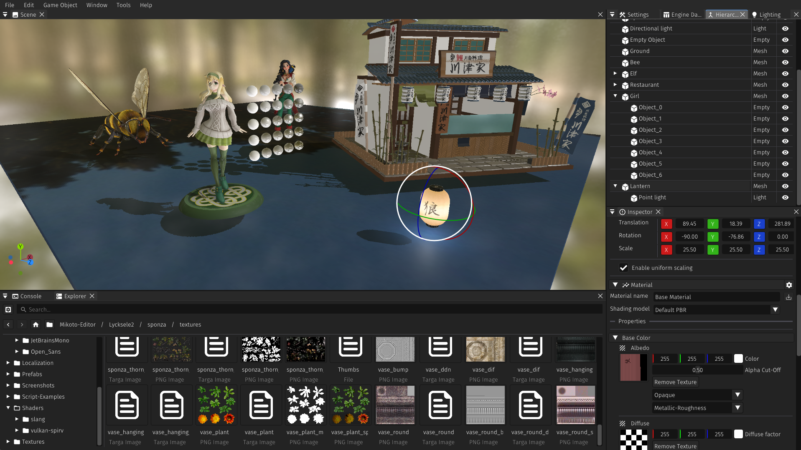

# Mikoto Engine

[](https://www.codefactor.io/repository/github/katebea/mikoto)
[](https://opensource.org/licenses/Apache-2.0)

**Mikoto** is an open-source, Vulkan-based game engine written in modern C++. Developed as an educational project, the engine aims to provide hands-on learning experiences in graphics programming while helping me explore the capabilities of the Vulkan API.

The ``develop`` branch is a WIP for the Mikoto's new architecture. It brings some new features, like resources pools, automatic resource cleanup, and abstraction on top of render
passes, amongst other features.

---



---


---


---


---
### Features

Mikoto is built around a Vulkan renderer and a collection of focused, open-source libraries. The currently supported features include:

**Core**

* **Entity Component System** — Scene and game object management powered by [skypjack/entt](https://github.com/skypjack/entt).
* **3D Model Loading** — GLTF support through [syoyo/tinygltf](https://github.com/syoyo/tinygltf), with [assimp/assimp](https://github.com/assimp/assimp) used for additional model formats.
* **Image Loading** — Texture and image loading through [nothings/stb](https://github.com/nothings/stb), with Wuffs being considered for future format support.
* **HDR & Environment Maps** — HDR image loading through `stb_image`, with support for converting equirectangular environments into cube maps.
* **Physics** — Rigid-body physics and collision handling through [jrouwe/JoltPhysics](https://github.com/jrouwe/JoltPhysics).
* **Audio** — Audio playback [mackron/miniaudio](https://github.com/mackron/miniaudio).
* **Scripting** — Lua scripting integrated through [ThePhD/sol2](https://github.com/ThePhD/sol2).
* **Text Rendering** — MSDF-based text rendering using [Chlumsky/msdfgen](https://github.com/Chlumsky/msdfgen).

**Rendering**

* **Vulkan Renderer** — Vulkan-based rendering architecture with a scene graph.
* **Clustered Forward+** — Clustered lighting and light culling for the primary rendering path.
* **Infinite Grid** — Procedural editor/world grid.
* **HDR Rendering** — HDR image and environment support.

**Editor**

* **ImGui Integration** — Runtime and editor UI through [ocornut/imgui](https://github.com/ocornut/imgui).
* **Transform Gizmos** — Move, rotate, and scale tools through [CedricGuillemet/ImGuizmo](https://github.com/CedricGuillemet/ImGuizmo).
* **Asset Hot Reloading** — Reload supported assets and scripts without restarting the editor.

For a complete list of third-party libraries and how they are used throughout the engine, see the **[Third-Party Libraries](THIRD_PARTY.md)** page.

### **Platform Support**

| Platform        | Architecture | Compiler | CMake Generator      | Rendering API       |
|-----------------|--------------|----------|----------------------|---------------------|
| **Windows 10+** | x86_64       | MSVC     | Visual Studio, Ninja | Vulkan, Direct3D 12 |
| **Linux**       | x86_64       | GCC      | Ninja, Make          | Vulkan              |

Mikoto is currently developed and tested on **Windows** and **Ubuntu 24.04 LTS**.
The primary development toolchains are **MSVC** on Windows and **GCC 13.3.0** on Linux.

Other distributions, architectures, compilers, and build generators may be supported, but have not been formally tested.

---
## Requirements

Mikoto currently targets **C++20** and uses **CMake** for project configuration and builds.

### Supported Platforms

* **Windows** — Visual Studio 2022 or newer with the Vulkan SDK.
* **Linux** — GCC 13.3.0 or newer with the Vulkan development packages installed.

### Required Software

* **CMake 3.22+** — Used to configure and generate the project build system.
* **Vulkan SDK** — Required for Vulkan development, validation, and shader tooling. Install the latest SDK from [LunarG](https://vulkan.lunarg.com/).
* **C++20-compatible compiler** — Mikoto is developed and tested with **GCC 13.3.0** on Linux and **MSVC** through Visual Studio on Windows.
* **Visual Studio 2022+** — Required on Windows and provides the recommended MSVC toolchain and IDE.

Additional platform-specific dependencies and setup instructions are covered in the **[Building Guide](BUILDING.md)**.

---

## Folder Structure

The repository is organized into separate projects for the engine, editor, examples, and tests:

```text
Mikoto/
├── Resources/
├── Mikoto-Engine/
├── Mikoto-Editor/
├── Mikoto-Sandbox/
├── Mikoto-Tests/
└── Mikoto-Apps/
```

| Directory             | Description                                                                                                            |
|-----------------------|------------------------------------------------------------------------------------------------------------------------|
| **`Resources/`**      | Repo stuff and some models, textures, and other assets to play around with.                                            |
| **`Mikoto-Engine/`**  | Core engine implementation, including rendering, ECS, physics, asset management, scripting, and other runtime systems. |
| **`Mikoto-Editor/`**  | Editor application built on top of the engine for creating, editing, and managing scenes.                              |
| **`Mikoto-Sandbox/`** | Sample application used to experiment with and demonstrate Mikoto's features.                                          |
| **`Mikoto-Tests/`**   | Tests covering engine systems and core functionality.                                                                  |
| **`Mikoto-Apps/`**    | Standalone applications and smaller examples built with Mikoto.                                                        |

### External Assets

Some demonstration models used by Mikoto are sourced from [Morgan McGuire's Computer Graphics Archive](https://casual-effects.com/data/).

---
## Building

Mikoto is currently verified to build on both **Windows** and **Linux**.

The build setup is managed through **CMake**, with platform-specific instructions covering dependencies, prerequisites, and development environments.

For a complete guide, including:

* Windows and Linux prerequisites
* Lua setup
* Linux dependency installation
* Repository and submodule setup
* CMake configuration and build commands
* Visual Studio and CLion workflows

see the **[Building Guide](BUILDING.md)**.

> **Windows:** Visual Studio and the Vulkan SDK are required.
> **Linux:** Required system dependencies must be installed before building.

---
## Dependencies

Mikoto builds upon a range of open-source libraries that provide functionality across rendering, asset management, physics, audio, scripting, editor tooling, and engine infrastructure.

The complete list of third-party dependencies, including their purpose and upstream repositories, is maintained separately in the **[Third-Party Libraries](THIRD_PARTY.md)** document.

Mikoto would not be possible without the work of the developers and communities behind these projects.

---
## Networking

Mikoto provides a lightweight networking layer built on top of [chriskohlhoff/asio](https://github.com/chriskohlhoff/asio), with support for **TCP**, **HTTP**, and **HTTPS** connections.

HTTPS support requires **OpenSSL** to be available on the target system. When OpenSSL is not installed, Mikoto automatically falls back to **HTTP-only** support.

---
## Profiling with Tracy

Mikoto integrates the Tracy Profiler for CPU, GPU, and memory profiling.
>When Tracy instrumentation is enabled, the Tracy Profiler GUI must be running.
If the profiler is not connected, Tracy will continue to run internally, which can lead to memory leaks.
> By default Tracy is disabled, in order to enabled one must compile with the ``MIKOTO_ENABLE_TRACY_PROFILING``
> flag enabled in the ``CmakeLists.txt`` file. See the [Editor CMake](Mikoto-Editor/CMakeLists.txt) file for reference.
> 
> User will need to run Mikoto with Tracy's Profiler v3.3.0 which is the version used by the engine.

---
## Slang in Mikoto

Mikoto uses the **Slang shading language** for runtime shader compilation (Reflection is still done by spirv-reflect).  
The engine ships with **precompiled Slang binaries**, so no manual setup is required to use Slang with Mikoto.

If you prefer to download or update Slang manually, you can find the official releases here:

- **Slang GitHub Repository:** https://github.com/shader-slang/slang  
- **Latest Slang Release Used by Mikoto (v2026.10):** https://github.com/shader-slang/slang/releases/tag/v2026.10

Mikoto will automatically use the bundled version, but replacing it with another official release is supported as long as the Slang directory structure remains unchanged.

---
## Goals

The primary goal of Mikoto Engine is to serve as a learning platform for exploring modern graphics programming techniques. Features are implemented progressively as new concepts and ideas are explored.

---
## Special Thanks

The development of Mikoto has been inspired by the work of the following:

- **Joey De Vries** for the incredible [LearnOpenGL](https://learnopengl.com/) tutorials.
- **Yan Chernikov** for his insightful [YouTube videos](https://www.youtube.com/@TheCherno).
- **Cem Yuksel** for his educational [graphics programming videos](https://www.youtube.com/@cem_yuksel/videos).
- **Jason Gregory** for the book *[Game Engine Architecture](https://www.gameenginebook.com/)*.
- **Matt Pharr, Wenzel Jakob, Greg Humphreys** for *[Physically Based Rendering: From Theory to Implementation](https://www.pbr-book.org/)*.
- **Sascha Willems** for the [Vulkan examples repository](https://github.com/SaschaWillems/Vulkan).
- **Marco Castorina and Gabriel Sassone** for the Mastering Graphics Programming with Vulkan Book.

---
## Future Development

Mikoto Engine is still in its early stages, and additional features and optimizations will be added over time.
Feedback is always welcome!

---
## License

This project is licensed under the **Apache License 2.0**.

You are free to use, modify, and distribute this software under the terms of the Apache License 2.0. A copy of the license is included in the repository.

For the full license text, see the [LICENSE](LICENSE) file in the repository.

